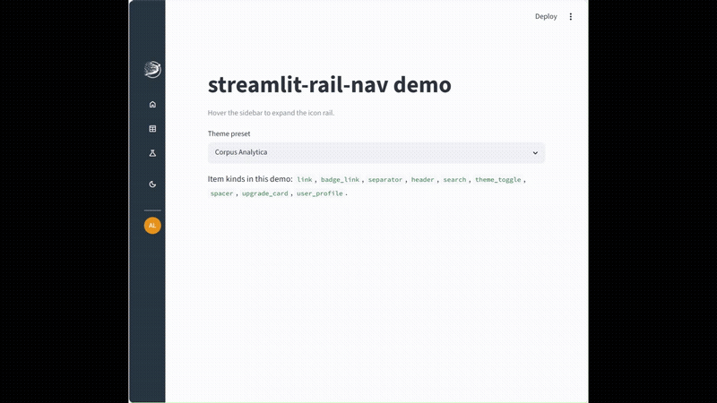

# streamlit-rail-nav

[](https://pypi.org/project/streamlit-rail-nav/)
[](https://www.python.org/)
[](LICENSE)

A collapsible **icon-rail sidebar navigation** for Streamlit that expands on
hover — pure Python, no frontend build.

**[Live demo →](https://st-rail-nav.streamlit.app/)**

Inspired by the archived
[Socvest/streamlit-on-Hover-tabs](https://github.com/Socvest/streamlit-on-Hover-tabs)
project, but implemented differently under the hood: instead of rendering tabs
inside an iframe component, `streamlit-rail-nav` renders **native Streamlit
sidebar widgets** (`st.page_link`, `st.button`, `st.text_input`) and restyles
the native `stSidebar` into a rail via injected CSS. That keeps navigation
client-side, preserves session state, and needs no JS toolchain.

## Features

- Sidebar collapses to an icon rail, expands smoothly on hover
- Fully themeable: colors, sizes, widths, gaps, transitions
- Brand block: logo on expand, icon on rail, automatic light/dark variant pick
- Item kinds: `link`, `badge_link`, `separator`, `spacer`, `header`,
  `theme_toggle`, `search`, `upgrade_card`, `user_profile`
- Per-item `access` levels (normalized for you; filtered caller-side)
- Eight built-in theme presets
- Plain-dict config — round-trips cleanly with JSON persistence

## Install

```bash
pip install streamlit-rail-nav
```

## Quickstart

```python
import streamlit as st
from streamlit_rail_nav import render

st.set_page_config(layout="wide", initial_sidebar_state="expanded")

render({
    "items": [
        {"kind": "link", "label": "Home", "icon": "home", "page": "app.py"},
        {"kind": "badge_link", "label": "Data", "icon": "table",
         "page": "pages/Data.py", "badge": "New"},
        {"kind": "separator"},
        {"kind": "header", "label": "Workspace"},
        {"kind": "search", "label": "Quick search", "icon": "search"},
        {"kind": "theme_toggle", "label": "Dark mode", "icon": "dark_mode"},
        {"kind": "user_profile", "name": "Ada Lovelace",
         "subtitle": "Pro trial"},
    ],
    "footer": None,
}, footer="2026 | My App")
```

Icons use [Google Material Icons](https://fonts.google.com/icons) names
(`:material/<name>:` shortcodes work too).

## API

```python
render(
    config=None,                # dict matching the settings schema
    *,
    base_path=None,             # dir for resolving relative logo/icon paths
    on_theme_toggle=None,       # Callable[[], None]
    on_search=None,             # Callable[[str], None]
    on_upgrade_click=None,      # Callable[[], None]
    footer=None,                # caption text at the bottom of the sidebar
)
```

`config` is normalized over `DEFAULT_RAIL_SETTINGS` — pass only the keys you
want to override. For local `logo_src`/`icon_src` files, pass
`base_path=Path(__file__).parent`; `http(s)://` URLs work without it.

### Style keys

| Key | Default | Notes |
|---|---|---|
| `sidebar_bg` | `#313841` | sidebar background |
| `sidebar_text_color` | `#EEEEEE` | label text |
| `sidebar_icon_color` | `#EEEEEE` | icon glyphs |
| `sidebar_hover_bg` | `#3A4750` | item hover background |
| `sidebar_hover_text_color` | `#EEEEEE` | item hover text |
| `sidebar_active_bg` | `#EA9216` | current-page background |
| `sidebar_focus_outline` | `#EA9216` | focus/accent outline |
| `sidebar_separator_color` | `#3A4750` | separator/borders |
| `sidebar_font_size_px` | `14` | 12–24 |
| `sidebar_icon_size_px` | `20` | 16–32 |
| `sidebar_collapsed_width_px` | `68` | 56–120 (rail width) |
| `sidebar_hover_width_px` | `260` | 180–360 (expanded width) |
| `sidebar_item_gap_px` | `4` | 0–32 |
| `sidebar_transition` | `0.2s` | CSS transition duration |
| `hide_default_nav` | `true` | hide Streamlit's auto multipage nav |
| `logo_src` / `logo_src_light` / `logo_src_dark` | `""` | shown while expanded |
| `icon_src_light` / `icon_src_dark` | `""` | shown while collapsed |
| `logo_height_px` | `44` | spacer height under brand |
| `logo_render_height_px` | `36` | rendered logo height |
| `icon_render_height_px` | `36` | rendered icon height |
| `theme_mode` | `dark` | `light`/`dark` bookkeeping |

Light/dark brand variants are picked automatically from the sidebar
background luminance.

### Item kinds

| `kind` | Fields | Renders as |
|---|---|---|
| `link` | `label`, `icon`, `page`, `access` | `st.page_link` (falls back to button + `st.switch_page`) |
| `badge_link` | + `badge` | page link with a trailing badge pill |
| `separator` | — | horizontal rule |
| `spacer` | `spacer_px` | fixed-height gap |
| `header` | `label` | section label (hidden in rail) |
| `theme_toggle` | `label`, `icon` | button → `on_theme_toggle()` |
| `search` | `label` (placeholder), `icon` | compact input → `on_search(query)` |
| `upgrade_card` | `title`, `text`, `button_label` | promo card → `on_upgrade_click()` |
| `user_profile` | `name`, `subtitle`, `avatar_url`, `avatar_initials` | avatar + name row (rail shows avatar only) |

`access` accepts `public` / `logged_in` / `admin` and is preserved by
normalization, but **the package never filters on it** — filter caller-side:

```python
items = [i for i in cfg["items"]
         if can_access(i.get("access", "public"), current_user)]
render({**cfg, "items": items})
```

### Theme presets

`from streamlit_rail_nav import THEME_PRESETS` — eight palettes:
Anthropic Style, Ocean Palette, Corpus Analytica, Navy Gold Aqua, Cadet Yam,
Matcha Almond, Black & White (Light), Black & White (Dark).

Every preset passes WCAG AA contrast (>= 4.5:1) for both the resting state
(`sidebar_bg`/`sidebar_text_color`) and the hover state
(`sidebar_hover_bg`/`sidebar_hover_text_color`). `sidebar_active_bg` is a
subtle tint close to `sidebar_bg` rather than a loud accent color, so the
persistent "selected page" background never fights with the label text;
`sidebar_focus_outline` carries the accent color for the selected item's
icon instead.

```python
render({**THEME_PRESETS["Ocean Palette"], "items": [...]})
```

## Caveats

- Selectors rely on Streamlit `data-testid` attributes (not a stable public
  API). Verified on **Streamlit 1.57**; pinned `streamlit>=1.57,<2`.
- Badges are positioned via `nth-of-type` on sidebar element containers.
  Call `render()` **before** emitting other widgets into `st.sidebar`, or
  badge positions shift.
- The rail effect needs `initial_sidebar_state="expanded"` in
  `st.set_page_config`.

## Demo

Try it live: **[st-rail-nav.streamlit.app](https://st-rail-nav.streamlit.app/)**



Or run it locally:

```bash
pip install -e .
streamlit run examples/demo/demo_app.py
```

## Development

```bash
pip install -e ".[dev]"
pytest
black . && ruff check .
python -m build
```

## Author

Built by [Bernhard Zechmann](https://www.zechmann.de) ([@aizech](https://github.com/aizech))
at [Corpus Analytica](https://www.corpusanalytica.com).

## License

MIT — see [LICENSE](LICENSE). Derived conceptually from
[Socvest/streamlit-on-Hover-tabs](https://github.com/Socvest/streamlit-on-Hover-tabs) (MIT)
